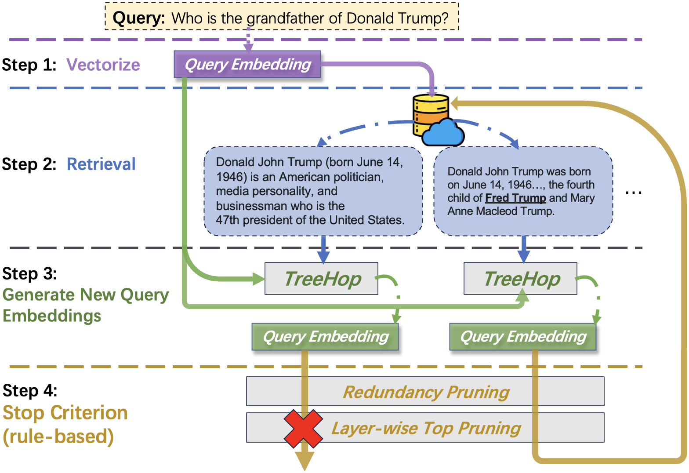
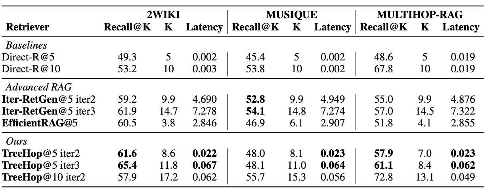

# TreeHop: Generate and Filter Next Query Embeddings Efficiently for Multi-hop Question Answering

[](https://img.shields.io/badge/license-MIT-blue)
[](https://www.python.org/downloads/)

## Introduction
TreeHop is a lightweight, embedding-level framework designed to address the computational inefficiencies of traditional recursive retrieval paradigm in the realm of Retrieval-Augmented Generation (RAG). By eliminating the need for iterative LLM-based query rewriting, TreeHop significantly reduces latency while maintaining state-of-the-art performance. It achieves this through dynamic query embedding updates and pruning strategies, enabling a streamlined "Retrieve-Embed-Retrieve" workflow. 



## Why TreeHop?
- **Cost-Effective**: 25M parameters vs. billions in existing methods, significantly reduces required computational resources.
- **Speed**: 99% faster inference compared to iterative LLM approaches.
- **Performant**: Maintains high recall with controlled number of retrieved passages.




## System Requirement
> Ubuntu 18.06 LTS+ or MacOS Big Sur+. \
> Nvidia GPU or Apple Metal with 32GB of RAM at minimum. \
> 16GB of system RAM for [reproduction](#paper-reproduction), 64GB for [training](#train-treehop). \
> 50GB of free space on hard drive.


### Python Environment
Please refer to [requirements.txt](/requirements.txt).


## Preliminaries
This repository comes with model parameters and evaluate embedding database, activate git lfs to clone the repository using `git lfs clone [LINK_TO_REPO]`, or pull the data under the existing local repository using:
```sh
git lfs pull
```

### Embedding Databases
Run the following two scripts that generate all necessary training and evaluate embedding databases.
They are not required if you do not plan to train TreeHop, as all necessary evaluate embedding databases are provided in the repository.
We adopt [BGE-m3](https://arxiv.org/abs/2402.03216) for embedding generation, upon which we also train our TreeHop model for multi-hop retrieval.
```sh
python init_train_vectors.py
python init_multihop_rag.py
```

## Multi-hop Retrieval with TreeHop: How-to-Use
Here we take [MultiHop RAG evaluate dataset](https://arxiv.org/abs/2401.15391) as embedding database in the following sample code.
For code related to file arguments `passage_embeddings` and `faiss_index` in the `MultiHopRetriever`, please refer to [preliminaries](#preliminaries).

```python
from evaluation import get_evaluate_model
from passage_retrieval import MultiHopRetriever


# load TreeHop model
TREEHOP_MODEL_FILE = ("checkpoint/treehop__epoch=8&n_neg=5&neg_mode=paired"
                      "&g_size=2048&mlp_size=2048&n_mlp=3&n_head=1&dropout=0.1"
                      "&batch_size=64&lr=6e-05&temperature=0.15&weight_decay=2e-08.pt")

tree_hop_model = get_evaluate_model(TREEHOP_MODEL_FILE)

# load retriever
retriever = MultiHopRetriever(
    "BAAI/bge-m3",
    passages="embedding_data/multihop_rag/eval_passages.jsonl",
    passage_embeddings=f"embedding_data/multihop_rag/eval_content_dense.npy",
    # uncomment this if faiss index is initialized, resulting in a faster loading
    # faiss_index="embedding_data/multihop_rag/index.faiss",
    tree_hop_model=tree_hop_model,
    projection_size=1024,
    save_or_load_index=True,
    indexing_batch_size=10240,
    index_device="cuda"
)
```
> :bell: Notes
> * The passage jsonl file contains id, title and text for each passage in the retrieval database, and the faiss_index/passage_embeddings file contains passage embeddings in faiss/numpy array format. To replace them with your own database, please refer to [init_multihop_rag.py](init_multihop_rag.py) and create them for yourself.
> * For more detailed structure of passages file, please refer to [MultiHop RAG evaluate passages file](embedding_data/multihop_rag/eval_passages.jsonl).

The `multihop_search_passages` method supports retrieving both single query and batch queries.
For single query:
```python
retrieve_result = retriever.multihop_search_passages(
    "Did Engadget report a discount on the 13.6-inch MacBook Air \
        before The Verge reported a discount on Samsung Galaxy Buds 2?",
    n_hop=2,
    top_n=5
)
```

For batch queries:
```python
# change batch sizes on your device to optimize performance
retrieve_result = retriever.multihop_search_passages(
    LIST_OF_QUESTIONS,
    n_hop=2,
    top_n=5,
    index_batch_size=2048,
    generate_batch_size=1024
)
```

To access retrieved passages and corresponding multihop retrieval paths:
```python
# retrieved passages
print(retrieve_result.passage)

# employ networkx graph to depict multihop retrieval
retrieve_result = retriever.multihop_search_passages(
    LIST_OF_QUESTIONS,
    n_hop=2,
    top_n=5,
    index_batch_size=2048,
    generate_batch_size=1024,
    return_tree=True        # simply add this argument
)
# the retrieve_result.tree_hop_graph is a list of networkx objects correspondent to the LIST_OF_QUESTIONS.
# take the first query for example, to draw the respective multihop path:
retrieval_tree = retrieve_result.tree_hop_graph[0]
retrieval_tree.plot_tree()

# following Networkx api, to check the nodes representing passages in the retrieval graph:
retrieval_tree.nodes(data=True)
```

## Paper Reproduction
To evaluate TreeHop multihop retrieval, run the following code. Here we take 2WikiMultihop dataset and recall@5 with three hops as example.
> * To change dataset, replace `2wiki` with `musique` or `multihop_rag`.
> * Revise `n_hop` and `top_n` to change number of hops and top retrieval settings. 
> * Toggle `redundant_pruning` and `layerwise_top_pruning` to reproduce our ablation study on stop criterion.

```sh
python evaluation.py \
    --state_dict "checkpoint/treehop__epoch=8&n_neg=5&neg_mode=paired&g_size=2048&mlp_size=2048&n_mlp=3&n_head=1&dropout=0.1&batch_size=64&lr=6e-05&temperature=0.15&weight_decay=2e-08.pt" \
    --dataset_name multihop_rag \
    --n_hop 3 \
    --top_n 5 \
    --redundant_pruning True \
    --layerwise_top_pruning True
```


## Train TreeHop
Run the following code to generate graph and train TreeHop. Please refer to `parse_args` function in the [training.py](./training.py) for arguments to this script.
For training embedding generation, please refer to code in [init_train_vectors.py](./init_train_vectors.py)
```sh
python training.py --graph_cache_dir ./train_data/
```
